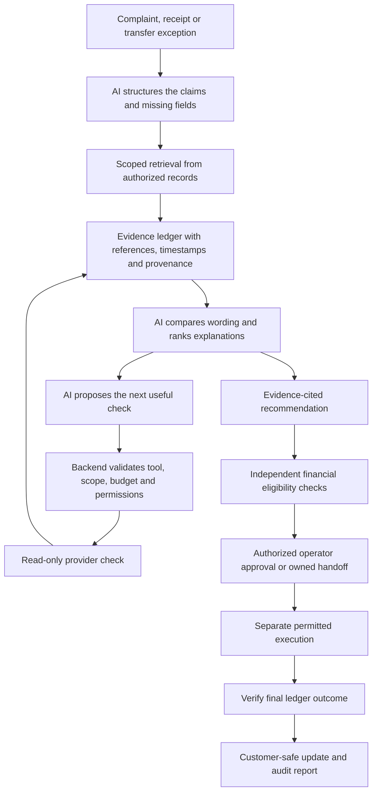

# DataUkil: AI depth, production value and explanation for judges

Prepared on **4 October 2026**, Asia/Dhaka. Based on the repository's implementation through commit `6cdd4fe`, the saved evaluation artifacts and the primary sources linked below.

This document distinguishes three things throughout: **implemented prototype behavior**, **proposed production capabilities**, and **impact that still requires measurement**. The production sections describe the intended system, not integrations or model performance already delivered.

## 1. The central proposition

**DataUkil would use AI to turn an MFS complaint into an evidence-backed investigation and a reviewable next action. Financial records establish what happened; provider policy determines what is allowed; an authorized operator controls a correction.**

The valuable unit of work is a prepared investigation: the complaint, exact transaction context, relevant observations, competing explanations, missing evidence, permitted remedy and verified follow-up in one case.

AI contributes substantially when the inputs are varied: informal Bangla, Banglish and English complaints, receipts, messages, unfamiliar error wording and inconsistent partner descriptions. Exact record lookups, accounting and permission checks remain ordinary software. The design should measure whether AI improves the investigation beyond that software baseline.

## 2. What problem we can support with evidence

The user's **7 lakh / 700,000 issues** figure was attributed to a **Dhaka Bank survey from 2025**. A matching public report has not been located during this review, so the figure has not been independently verified. Its exact report/page, reporting period, incident definition, provider coverage and deduplication method are needed before presenting it as a national statistic. Failed requests, unique failed transfers, customers affected, complaint contacts and unresolved cases are different counts.

Three primary sources establish a credible context without relying on that figure:

- Bangladesh Bank's published MFS table reports **721,866,474 total transactions in January 2025**. This is historical transaction volume, not the number of complaints or failures. [Bangladesh Bank MFS statistics](https://www.bb.org.bd/en/index.php/financialactivity/mfsdata).
- TIB's May 2025 survey reports that **22.2% of surveyed personal account holders who experienced MFS difficulties reported delays or failures in funds reaching recipient accounts**. It also reports that **61.9% of complainants received no solution from MFS providers**. These are survey subgroup results, not failure rates across all transactions, not a count of paid-twice incidents and not provider-specific statistics. [TIB extended executive summary, page 11](https://www.ti-bangladesh.org/images/2025/report/mfs/Executive-Summary-Mobile-Financial-Services-Sector-En.pdf).
- Bangladesh Bank's September 2026 Bangla QR dispute guideline lists **reason code 2414** for a claim that the same purchase was paid twice through QR or another payment method. This supports the relevance of our QR + cash example; it does not validate our prototype's refund eligibility. The official PDF was verified through indexed primary-source text; direct PDF retrieval was unsuccessful. [Bangladesh Bank Bangla QR dispute guideline](https://www.bb.org.bd/mediaroom/circulars/psd-2/sep272026psd-205.pdf).

Our interpretation is that there is a valuable investigation and service-resolution problem to address. The sources do not establish that every unresolved complaint is caused by fragmented records, or that AI alone could resolve every complaint.

## 3. Why a transfer can become difficult to investigate

A bank-to-wallet transfer spans multiple components. The bank can record a debit while a wallet worker is still queued. A wallet credit can succeed while its acknowledgement is lost. Two requests can share one posting identity. Original processing can complete after a timeout.

Consequently, these statements are different:

| Observation | What it establishes | What remains open |
| --- | --- | --- |
| Phone displays failure/no confirmation | What the customer interface observed | Whether a later posting or settlement occurred |
| Bank balance decreases | A customer-observed change | Hold versus final debit; exact posting and transaction association |
| Bank confirms a posted debit | The scoped source-side posting | Destination credit, return or final settlement |
| Two retry requests appear | Two attempts occurred | Whether one or two financial debits occurred |
| Wallet confirms an exact credit | The destination posting | Whether the bank also posted an extra debit |
| Receipt says cash received | The submitted wording supports the cash claim | Authenticity, purchase association and independent cash corroboration |
| Refund request is accepted | A request exists | Whether the refund actually posted |

The investigation must distinguish these facts before choosing a remedy. Refunding an original transfer that can still complete may create another financial discrepancy. Re-crediting a wallet whose acknowledgement was lost may pay twice. Closing a QR complaint because QR succeeded can ignore a second cash payment.

## 4. How the ideal production AI would work

The proposed production loop is **understand → retrieve → compare → investigate → propose → approve → verify → explain**.



### 4.1 Understand the customer and prepare the case

Example complaint: **“Bank theke taka keteche, upay e asheni.”** The desired future language model should identify a reported source debit, a reported missing destination credit and the need for the exact transfer reference. It must preserve both as claims until confirmed.

For **“QR fail dekhailo, cash dilam, pore account thekeo katse”**, it should identify a different problem: unclear QR display, claimed cash tender and a later claimed bank debit for the same purchase.

Proposed learned tasks include intent classification, entity extraction, temporal interpretation, negation handling and multilingual normalization. The customer reviews extracted details before submission. Ambiguous account/reference fields are confirmed rather than guessed.

Useful output: issue category, amount, reference, approximate time, claimed payment methods, chronology and the first missing field. Customer urgency can inform review priority, but wording or dialect should not decide financial entitlement or cause a complaint to be rejected.

**Value:** fewer repeated explanations, fewer incomplete intake records and earlier routing to the correct investigation. Voice transcription and agent-assisted intake would widen access; neither is implemented as an AI intake service today.

### 4.2 Turn document evidence into inspectable fields

A future document pipeline could combine image cleanup, document-layout detection, OCR and structured extraction. It would output field candidates, bounding boxes, value source, confidence and review flags while preserving the original file.

For a cash receipt, fields might include merchant, invoice/purchase reference, item, amount, tender method, cash reference and time. Low-quality digits and conflicting amounts require confirmation. Document extraction can improve understanding of a receipt; it cannot establish that the merchant really received cash.

**Current boundary:** our OpenCV pipeline performs visual contour/region detection and annotation. Values come from the preserved transcript or deterministic synthetic fixture wording. OpenCV is not OCR, receipt authentication or a trained vision model in this project. The moving scan beam visualizes processing; it does not add evidence authority.

**Value:** less manual document reading and easier review of exactly which extracted field needs correction. The production benefit depends on measured Bangla receipt extraction quality.

### 4.3 Retrieve the right records without mixing customers or purchases

Production integration would require authorized adapters to provider records: bank postings, wallet ledger, settlement, gateway callbacks, attempt history, merchant/POS records and relevant Marketplace orders.

Exact reference queries should use deterministic code. AI-assisted retrieval is useful for finding relevant passages within the authorized case, interpreting differing partner descriptions and locating applicable runbooks or similar resolved incidents.

A retrieved record needs its identifier, source capability, query scope, event time, as-of time and relationship to the current case. Similar amount/time or a semantically similar receipt is a candidate match, not authority to merge two purchases or reverse a payment. A validated mapping or human confirmation is required.

**Value:** less time switching tools and reading unrelated records. Connectors and source access supply the facts; AI helps organize and interpret those facts.

### 4.4 Compare what each passage actually says

The learned evidence task is a three-way relation between a claim and a passage:

| Claim | Passage | Intended semantic result |
| --- | --- | --- |
| Cash was received | Cash received for purchase P-17 | Supported by this passage |
| Cash was received | Cash has not been received | Contradicted by this passage |
| Cash was received | Customer requested a cash receipt | Insufficient evidence in this passage |
| Refund completed | Refund requested | Insufficient evidence in this passage |
| Two debits occurred | Request retried twice | Insufficient evidence in this passage |

The passage's source authority and exact transaction relationship are evaluated separately. A customer-uploaded receipt can textually support cash receipt while remaining unverified evidence. A confidently interpreted passage about another purchase is irrelevant to this case.

**Value:** recognizes paraphrases, negation and ambiguity that a short list of keywords can miss. Production training must demonstrate an advantage on independently reviewed language and evidence, including unfamiliar wording.

### 4.5 Diagnose the discrepancy and select the next useful check

The proposed investigator should maintain supported, contradicted and unresolved explanations rather than inventing a single confident story.

For a missing wallet credit, hypotheses include lost acknowledgement, delayed original processing, worker failure before credit, ambiguous mapping and duplicate debit. The useful next check depends on the returned evidence.

If the wallet ledger already contains the exact credit, re-crediting is unnecessary: check the callback path. If no credit is found as of now, obtain the partner's processing state and finality before proposing a replay. If mapping is ambiguous, stop the correction path and request authoritative identity evidence.

A future model could rank hypotheses and propose read-only checks using expected information gained, source cost, latency and risk. The orchestrator would still require mandatory checks, enforce allowlisted tools and case scope, limit calls and stop on sufficient evidence. Learning would improve the order of permitted checks; it would not remove required financial prerequisites.

This is the deeper agentic part of the proposal: a bounded feedback loop where each observation changes the next investigation action. Today Add money implements this loop with a rules policy; the Studio uses a fixed phase/source collection path and optional model-assisted hypothesis ordering. Neither is an unrestricted production agent.

**Value:** less unnecessary checking and a useful first investigation packet for human specialists. Time saved in preparation does not eliminate waiting for a bank or merchant response.

### 4.6 Produce a reviewable recommendation and a useful human handoff

A production recommendation should state the discrepancy, supporting and conflicting evidence, missing prerequisites, exact proposed operation, cited references, intended amount and remaining uncertainty.

Possible actions include refreshing a stale acknowledgement, safely resuming an original instruction, proposing an authorized duplicate-debit reversal, requesting merchant corroboration or handing over a case that cannot be resolved from available evidence.

For an uncertain case, the packet should include checks already performed, source failures, missing evidence, current owner, receiving queue and next review time. This saves the human from starting again.

**Value:** reduced case-preparation work even when automation cannot resolve the incident. Uncertainty is a documented result with an owner, not a failed model response or an unsupported rejection.

### 4.7 Verify the outcome and explain it to the customer

The AI can draft a plain Bangla or English explanation from approved facts: what is confirmed, what is outstanding, who owns the case and what happens next. Templates and structured validation should constrain financial status claims.

The completed refund/credit must come from a verified source event. A prediction, approval or submitted request must not be described as money returned. The customer can inspect progress, provide more evidence and seek review of a rejection.

**Value:** fewer avoidable follow-up contacts and clearer expectations. Reduced repeat contacts and customer comprehension require a user study; they are not established by a polished status screen.

### 4.8 Learn from approved incident outcomes

Later, de-identified incident histories could support recurring-error clustering, queue-risk estimation and suggestions for operational fixes. A concentration of verified callback failures might direct engineers to a partner integration; it would not itself prove the root cause.

Learning uses reviewed outcomes and corrected evidence rather than treating every operator approval as ground truth. Model updates need versioned datasets, held-out tests and controlled release.

**Value:** potential reduction in repeat incident categories, beyond handling existing complaints. This remains a future capability, and infrastructure problems still require engineering fixes.

### 4.9 Use several bounded capabilities, with separate uncertainty

The production proposal should assign narrow responsibilities instead of asking one language model to perform every task:

| Capability | Proposed output | What validates it |
| --- | --- | --- |
| Intake language model | Issue/claim fields, original wording and missing details | Schema checks and customer confirmation |
| OCR/layout model | Candidate receipt fields and boxes | Field-level evaluation, original-image review and correction |
| Retrieval/semantic verifier | Relevant passages and supported/contradicted/insufficient labels | Case authorization, citations, independent held-out labels |
| Investigation planner | Hypothesis order and next permitted read-only check | Mandatory prerequisites, tool scope and call budget |
| Explanation model | Plain-language draft from saved approved facts | Citation/fact checks and safe status templates |

Extraction confidence, claim/passage confidence, source completeness and action eligibility are different signals. A 95% confident reading of “cash received” on an unverified upload does not mean a 95% chance that a refund is financially justified. Calibrated semantic confidence could determine when to request review, while verified source contracts independently determine financial prerequisites.

To serve a large workload, deterministic exact-ID retrieval and small classifiers can handle common tasks. More expensive language-model review can be reserved for varied or ambiguous evidence. Durable background jobs, indexed source queries, batching, caching tied to evidence versions and bounded context would be production infrastructure work. The current SQLite/local prototype is not a demonstrated national-throughput deployment. Measure model cost, latency and operator effort together.

## 5. The two strongest demonstrations

### 5.1 Add money: bank debited, wallet appears uncredited

Use a fictional **BDT 1,000** transfer.

1. Customer reports a bank deduction and missing wallet money.
2. Source checks determine whether it is a hold or final debit and identify the exact original instruction.
3. Wallet ledger check determines whether the intended credit already posted.
4. Partner status, attempts, mapping and worker records narrow the explanation.
5. The system proposes the remedy supported by current evidence and contract.
6. Operator approval is separate from execution; execution is followed by verification.

| Evidence-backed finding | Suitable response |
| --- | --- |
| Exact wallet credit exists; acknowledgement failed | Update customer status; do not credit again |
| Worker failed before credit; exact mapping and safe replay authorized | Propose resuming the original instruction once |
| Original remains capable of completing | Observe/wait or obtain finality; do not create an unsupported return |
| Source unavailable or mapping ambiguous | Owned handoff with missing evidence and review time |

Explain the production AI as reducing the analyst's reading and diagnosis effort across those branches. The existing Add money policy makes its decisions deterministically from returned observations.

### 5.2 QR + cash: one purchase, possible two payments

Use a fictional **BDT 500** purchase. The phone shows QR failure/no confirmation, the customer pays cash and obtains a receipt, then observes a later bank deduction.

The production investigation would separately verify:

- Exact purchase and invoice amount.
- QR transaction and acquiring/settlement context, not only a customer balance screenshot.
- Bank debit status and reference.
- Cash tender independently corroborated by an authorized merchant/POS record.
- The receipt's relationship to that purchase.
- Prior refund/reversal and whether another obligation or split tender explains the amounts.

Two payment methods do not automatically mean excess payment. BDT 300 QR plus BDT 200 cash can be a valid BDT 500 split tender. Two BDT 500 payments for different purchases also do not establish this complaint.

If the same BDT 500 purchase has two independently confirmed BDT 500 payments and no prior repayment, the records support an excess-payment investigation. The responsible institution's rules and dispute process still determine the remedy and funding source. AI should assemble this evidence and propose an eligible next step, not assume a Marketplace match alone authorizes a bank refund.

Conflicting identity/amount records support a documented conflict or rejection subject to review. Missing data or a timeout supports uncertainty and human follow-up. Unavailable records do not establish a false complaint.

**Current demo:** the Marketplace adapter is bounded and synthetic; a legitimate verdict proposes an explicitly operator-approved simulated refund, and a separate completed event establishes its demo completion.

## 6. Where AI is involved today

| Component | Implemented behavior | Accurate judge description |
| --- | --- | --- |
| Trained verifier | Frozen multilingual E5-small encoder; trained standardized logistic regression head; claim/passage labels | A trained advisory semantic verifier, not a learned financial-eligibility engine |
| Runtime selection | Rules are primary; actual learned labels are shown when the artifact runs; explicit fallback otherwise | The measured baseline controls the current advisory path |
| Optional local Qwen | Strict JSON assessment with verification, hypothesis order, action proposal and evidence IDs | A constrained local model assessment when the provider is available |
| Qwen's current inputs | Already checked verdict, evidence-derived expected action, known hypotheses and bounded evidence | Model-assisted review; not independent discovery of the verdict or an autonomous tool planner |
| Qwen validation | Valid citation/hypothesis IDs; checked-verdict agreement; unsupported action blocked | Model output is validated, and it cannot authorize a correction |
| Studio trace | Eleven persisted phases, citations, hypotheses and events | An observable investigation record, not disclosure of private model reasoning |
| Add money investigator | Read-only bounded tool loop and deterministic policy | Rules-based investigation; a suitable interface for a future learned policy |
| QR scan | OpenCV region detection; transcript-supplied values | Visual assistance, not OCR or authentication |
| QR verdict | Deterministic exact-context synthetic comparison | A rules-based case branch, not a trained fraud detector |
| Customer explanations | Saved verified updates and bilingual templates | Grounded communication already works; flexible AI explanation is proposed |

The website's animations demonstrate state changes, query progress and evidence provenance. They should never be used as proof that more AI has run than the backend actually performed.

## 7. The existing ML depth and its limits

The current learned pipeline is inspectable:

```text
Claim + bounded visible passage
→ normalization for model input, with originals preserved
→ frozen multilingual E5-small embeddings
→ claim/passage embeddings + difference/product + lexical features
→ StandardScaler + class-balanced logistic regression
→ supported / contradicted / insufficient-evidence label
→ independent source, reference and financial checks
```

Only the classifier head is trained. The encoder is not fine-tuned. Input features do not contain the hidden simulation profile or future repayment event. Artifact hashes and metadata make the model identity inspectable; the output is not a calibrated probability of financial truth.

| First preserved evaluation | Learned macro F1 | Interpretation |
| --- | --- | --- |
| Grouped synthetic test, 432 pairs | 0.827 | Performance on the generated, grouped test distribution |
| Separately authored challenge, 37 pairs | 0.471 | Broader wording exposes a substantial generalization weakness |

Training used 1,080 synthetic pairs, with 432 development pairs. Neither corpus has independent human annotation. The revised rules' 0.972 challenge score uses the reused challenge set; it is not an untouched-test result. A model label is not a receipt-authenticity, fraud or reimbursement score.

Prior validation records include trained inference and local Qwen runs. The latest local full-suite record has two existing ML failures: a dataset/manifest checksum mismatch and a missing `torch` dependency preventing verifier loading. Current demonstrations must show the actual runtime mode; a past artifact-backed run does not mean every current session uses the model.

See [ML context](ML.md), [review protocol](REVIEW_PROTOCOL.md), [runtime implementation](../tracefix/verifier.py), [local model adapter](../tracefix/live_ai.py) and [latest validation](QR_UI_VALIDATION.md).

## 8. Why AI instead of only rules or a dashboard?

A dashboard helps a human find records. A workflow engine enforces a known sequence. Exact checks reconcile known IDs and amounts. These are useful without AI.

The proposed AI advantage is handling variation within the authorized evidence: interpreting multilingual complaints, extracting unfamiliar documents, recognizing contradictory wording, finding relevant passages, ranking explanations and drafting a source-cited case packet. A fixed sentence list becomes difficult to maintain as wording and providers vary.

However, if a case contains only already-normalized exact fields, simple deterministic code may be sufficient. Running a language model for arithmetic or a direct transaction lookup would add cost and potential errors without a clear benefit.

The key experiment is **the same workflow with rules alone versus with the learned components**, on equal evidence. Compare preparation time, required checks, unsupported conclusions, missed discrepancies and human corrections. If AI does not improve this comparison, keep the better baseline and improve or omit the model.

The local classifier's challenge weakness makes this production validation especially necessary. Architecture and a trained artifact demonstrate a hypothesis about value; they do not establish a deployed accuracy or cost benefit.

## 9. What changes at a 7 lakh case workload?

Treat the figure below as a **conditional workload example**, not a verified volume or measured saving.

For **N unique cases in the same reporting period**:

```text
Net operator hours saved
= N × eligible fraction × (baseline preparation minutes − assisted preparation minutes) / 60
  − additional review, correction and operational hours
```

If N = 700,000, 40% are suitable for assisted preparation, and preparation falls from 12 to 4 minutes in those cases:

```text
700,000 × 0.40 × 8 / 60 = 37,333 gross operator hours released
```

The 40%, 12 minutes and 4 minutes are assumptions. Released capacity is not automatically cash savings, recovered money or shortened settlement time. Costs for models, connectors, support, review and errors must be included. Do not call the example monthly or annual until the period is established.

The target mechanisms are fewer repeated readings and lookups, more cases prepared per operator, earlier routing of uncertainty, fewer preventable duplicate corrections, clearer customer updates and eventually fewer repeat incident causes. Each mechanism has a separate measurement.

## 10. How to prove the proposed value

1. **Establish the incident denominator.** Obtain authorized provider counts, define unique cases and distinguish attempts, contacts, failures and unresolved incidents.
2. **Validate source integration.** Test exact ownership/reference mapping, event finality, late events, posting deduplication and provider-specific correction contracts.
3. **Build independently reviewed data.** De-identify authorized cases; use independent bilingual reviewers; preserve disagreement and adjudication history.
4. **Prevent test leakage.** Split connected cases/template families and use temporal/provider holdouts. Keep a new final test untouched during model selection.
5. **Evaluate each learned task.** Measure intent/entity extraction, document fields, semantic labels, citation correctness and abstention by Bangla/Banglish/English and document quality.
6. **Compare whole investigations.** Measure operator preparation time, human corrections, missing evidence discovered, number of checks, cost per prepared case and wrong recommendations against a rules-only baseline.
7. **Use a supervised shadow pilot.** Prepare suggestions alongside existing operations without changing production money. Review rejected and uncertain cases as well as positives.
8. **Release gradually.** Begin with assisted intake and read-only investigation. Financial action requires its own provider authorization, tests and controlled release.

Important outcome metrics include p50/p95 preparation and resolution time, repeat customer contacts, reopen/appeal outcomes, unsupported financial statements, false refund eligibility, missed valid claims, harmful action rate and net cost. Overall classification accuracy alone is insufficient. Report coverage together with error rate so excessive abstention cannot make a weak system appear reliable.

## 11. Production safeguards that make AI useful in this domain

- Treat complaints and document instructions as evidence data, not tool commands.
- Retrieve only records authorized for the current case. Use production identity and service permissions; the current fixture-role switch is demo-only.
- Separate customer assertions, derived model observations and authoritative source facts.
- Require exact posting/reference/amount checks; semantic similarity cannot authorize money movement.
- Track source availability and as-of time. Missing information remains uncertainty.
- Preserve originals, hashes, revisions, citations and evidence versions. New evidence invalidates old proposals.
- Require an allowlist, check budget and scoped read-only tools for the investigator.
- Keep operator approval and financial execution separate. Verify idempotency, prior correction and late original completion before acting.
- Confirm the resulting ledger outcome before telling the customer money arrived.
- Preserve ownership until the receiving team acknowledges a handoff; permit additional evidence and review of rejection.
- Minimize sensitive inputs, control retention and use approved processing environments. Local hosting alone does not establish production security.

These controls reduce the chance that a language interpretation becomes an unauthorized financial action. The benefit of human review must also be measured: an operator who blindly accepts a proposal is not a reliable control.

## 12. A judge explanation you can deliver

### Approximately 90 seconds

> DataUkil addresses the investigation work behind disputed MFS payments. A customer's phone may show failure while the bank has posted a debit, or a wallet credit may succeed while its acknowledgement is lost. In QR purchases, the customer can pay cash after an unclear screen and later see another deduction. A support agent must establish what happened across several records before choosing a remedy.
>
> Our proposed AI understands Bangla, Banglish and English complaints, structures the claims, helps read evidence and prepares a transaction timeline. It compares each claim against cited records and identifies the next useful check. The operator sees the evidence for a recommendation, the conflicting facts and what is still missing.
>
> We keep language interpretation separate from financial authority. A receipt cannot authorize a refund. Verified records and provider rules must establish eligibility, an operator approves the action, and the final posting is checked before we tell the customer money has returned. Uncertain cases remain open with an owner and review time.
>
> Our prototype demonstrates saved customer/operator journeys, a trained multilingual advisory verifier, optional local model assessment and guarded synthetic outcomes. Our production goal is measurable reduction in investigation effort and safer, clearer resolution. Provider integration and independent real-case validation are the next steps.

### Explain the depth in five minutes

| Time | Demonstration | What to explain |
| --- | --- | --- |
| 0:00–0:45 | Customer problem | Screen failure, posted debit and wallet/merchant receipt are distinct observations |
| 0:45–1:30 | Structured evidence | AI's proposed role in multilingual intake and document extraction; current scan limitation |
| 1:30–2:30 | Investigation graph | Exact references, competing causes and the next useful read-only check |
| 2:30–3:30 | Claim/evidence matrix | Three-way semantic assessment; source authority checked separately |
| 3:30–4:15 | Approval and handoff | A correct remedy needs verified eligibility; uncertainty remains owned |
| 4:15–5:00 | Scale and proof | Conditional capacity calculation, actual model results and a provider shadow pilot |

Show one lost-acknowledgement case and one uncertain case as well as a refund/replay success. This demonstrates that the investigation's purpose is the right outcome, rather than always finding a way to pay.

### A short Bangla explanation

> DataUkil-এর AI গ্রাহকের অভিযোগ বুঝে সেটিকে যাচাইযোগ্য দাবিতে সাজাবে, প্রাসঙ্গিক রেকর্ড খুঁজে দেবে এবং কোন তথ্যটি মিলছে বা কোনটি এখনও অনিশ্চিত তা দেখাবে। ব্যাংক ডেবিট, ওয়ালেট ক্রেডিট, নগদ রসিদ ও রিফান্ডকে আলাদা করে যাচাই করা হবে। শুধু রসিদ বা AI-এর মতামতের ভিত্তিতে টাকা ফেরত যাবে না। যাচাইকৃত রেকর্ড ও প্রযোজ্য নিয়ম অনুযায়ী অপারেটর অনুমোদন দেবেন, তারপর লেনদেনের ফল নিশ্চিত করে গ্রাহককে জানানো হবে। অসম্পূর্ণ তথ্যের মামলাও দায়িত্বপ্রাপ্ত ব্যক্তি ও পরবর্তী পর্যালোচনার সময়সহ খোলা থাকবে।

## 13. Questions judges are likely to ask

**Is this just a chatbot?** It is a proposed investigation service integrated with scoped source retrieval, evidence comparison, persisted case state, recommendations, approvals and outcome verification. Customer conversation is only intake and explanation.

**Where is the learned AI in the prototype?** The multilingual encoder plus trained classifier head is a real learned semantic component. The optional local Qwen adapter produces a constrained assessment and hypothesis order. Add money decisions and the QR first-line pipeline currently use deterministic policies.

**Is the model deciding refunds?** No. It interprets evidence and may propose an action. Source facts, backend eligibility, provider authorization and operator approval determine execution.

**Does OpenCV authenticate the receipt?** No. It detects and annotates visual regions. Values currently come from a preserved transcript. Production OCR and corroboration are separate capabilities.

**What if the model is wrong or a provider is unavailable?** Unsupported/stale proposals are blocked; missing evidence remains uncertainty; the case goes to an owned review. This does not eliminate every risk, so pilot error measurement is required.

**Why is AI useful if rules currently perform better?** The future opportunity is language/document variation and investigation preparation. The current experiment has not yet demonstrated a dependable generalization advantage. The rollout must earn that advantage on independent cases against the same rules baseline.

**Can it fix all 7 lakh issues?** No verified coverage claim is available. It targets supported incident categories and reduces investigation effort where evidence access and reliable model performance permit it. Fraud, incorrect-recipient recovery and legal/merchant disagreements can require separate specialist processes.

**What is distinctive?** A coherent Bangladesh-focused multilingual evidence workflow across bank-to-wallet and mixed QR/cash incidents, with explicit uncertainty and guarded outcomes. Do not claim the entire category or the first such product in Bangladesh is new.

**What is the next milestone?** A provider-approved, read-only shadow pilot with independent bilingual labels and a matched rules-only comparison of preparation time, corrections, unsafe proposals and cost.

## 14. Repository evidence for this explanation

| Topic | Implementation or record |
| --- | --- |
| Learned classifier and preprocessing | [ml/train.py](../ml/train.py), [ml/features.py](../ml/features.py) |
| Actual inference and fallback | [tracefix/verifier.py](../tracefix/verifier.py), [artifacts/runtime_policy.json](../artifacts/runtime_policy.json) |
| Optional model's actual scope | [tracefix/live_ai.py](../tracefix/live_ai.py) |
| Studio phases and policy | [tracefix/investigation.py](../tracefix/investigation.py) |
| Independent approval/execution | [tracefix/operations.py](../tracefix/operations.py) |
| Evidence authority and arithmetic | [tracefix/domain.py](../tracefix/domain.py), [tracefix/payments.py](../tracefix/payments.py) |
| Bounded Add money loop | [tracefix/transfer/investigation.py](../tracefix/transfer/investigation.py), [policy.py](../tracefix/transfer/policy.py), [tools.py](../tracefix/transfer/tools.py) |
| QR visual assistance and source checks | [tracefix/qr_receipt.py](../tracefix/qr_receipt.py), [qr_workflow.py](../tracefix/qr_workflow.py) |
| Original benchmark results | [artifacts/evaluation_v1.json](../artifacts/evaluation_v1.json), [ML.md](ML.md) |
| Independent evaluation plan | [REVIEW_PROTOCOL.md](REVIEW_PROTOCOL.md), [data/ADJUDICATION.md](../data/ADJUDICATION.md) |
| Current implementation inventory | [PROJECT_IMPLEMENTATION.md](PROJECT_IMPLEMENTATION.md) |
