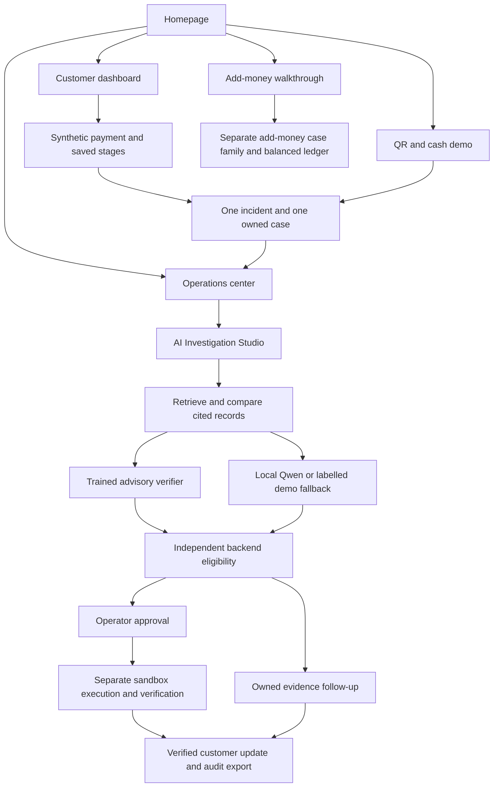

# Master-prompt implementation coverage

Authoritative input: [all 33 sections](MASTER_BUILD_PROMPT.md). Updated 3 October 2026 after integrating the newer `origin/main` homepage and add-money workflow. This matrix records implementation and validation evidence; it does not claim production readiness or independent model accuracy.

Each Studio event saves a phase, purpose, action, finding, changed state, citations, uncertainty and next step. Animation and replay use these saved events. Checking a source cannot establish an unknown payment result.

| Master section | Implementation | Validation evidence |
|---|---|---|
| 1. Product purpose | Homepage, README and shared persisted cases | Route/asset integration checks |
| 2. Customer payment experience | `payments.py`, customer dashboard, eight scenarios, default ৳1,000 | Eight-scenario balanced-record checks; browser transfer |
| 3. Complaint reporting | Stuck Transfer / Paid Twice, optional context and receipt | Complaint idempotency, supplied-context tests, actual PNG upload walkthrough |
| 4. One incident / one case | SQLite incidents and unique case mapping | Different action keys and concurrent complaint tests |
| 5. Customer tracking | Safe owned projection, owner, updates, next step, translations | Role/privacy tests; both saved ending projections |
| 6. Admin dashboard | Persisted overview cards, queue, age, priority and owner | Overview and cross-family integration checks |
| 7. Payment pipeline | Seven connected payment stages, saved events, separate investigation state | Eight scenarios and unknown-node inspection tests |
| 8. Expandable details | Node drawers with correlation, attempts, request/response and source timestamps | Source-inspection checks and browser settlement drawer |
| 9. Analyze Case | Asynchronous persisted run; immediate Studio navigation | Restart, interrupted-run and investigation API checks |
| 10. Dedicated Studio | Separate dark console route | Served-page/CSP tests and browser Studio journeys |
| 11. Observable investigation | Eleven phases with saved explanations and operations | Walkthrough asserts every explanation field and phase |
| 12. Automation graph | SVG phase graph, follow active node and evidence drawers | Browser graph controls and phase/citation inspection |
| 13. Live events | Authenticated fetch SSE with cursor and polling fallback | Ordered cursor tests; live add-money stream and Studio observations |
| 14. Summary panel | Current finding, coverage, uncertainty and next action | Saved-event/report agreement; browser completed Studio |
| 15. Possible causes | Supported / Contradicted / Unresolved hypotheses with cited history | Provider hypothesis validation; replay snapshots |
| 16. Evidence categories | Customer Statement / Customer Evidence / Confirmed System Record; derived observations separate | Source-authority and customer assertion boundary tests |
| 17. Paid-twice verification | Trained claim/passage advisory plus financial source checks | Real verifier loading, both end-to-end verdicts and legacy regressions |
| 18. Recommendations | Cited, bounded proposals independent of permission | Wrong proposal/citation/verdict/provider failure tests |
| 19. Controlled authorization | Allowlisted actions, cited approval, separate execution, balanced ledger | All three repairs, stale approval, concurrency, failed attempt and amount conservation |
| 20. Handoff | Team, owner, priority, next action; receiving acknowledgement | Ownership/handoff tests and actual uncertain-ending walkthrough |
| 21. History | Evidence revisions, case audit, run events, approvals and repair attempts | Export/replay agreement and retained historical cases |
| 22. Replay | Saved event cursor and historical evidence snapshots; no writes | Database dump unchanged by replay/report reads |
| 23. Presentation controls | Zoom, pan, fit, collapse, follow, playback speed, restart, isolated reset | Browser graph checks; reset preserves old and unrelated records |
| 24. AI modes | Ollama Qwen, 45-second deadline, validated structured output, explicit demo fallback | Live walkthrough and malformed/invented/timeout/offline adapter tests |
| 25. Customer updates | Verified bilingual facts; internal tasks stay private | Notification privacy, partial repayment and Bangla verified-fact tests |
| 26. Report export | Markdown/JSON reconstruction, citations, findings, hypotheses, decision, repair and remaining issues | SHA-256 and ledger agreement in actual walkthrough |
| 27. Access control | Server-issued scoped sessions, ownership and case-family guards | Customer/staff/presenter and cross-workspace integration tests |
| 28. UI layout | Light customer/operations pages, dark Studio, responsive panels, reduced motion | Browser desktop/mobile observations recorded in validation document |
| 29. Featured simulation | ৳1,000 duplicate reversal and missing-response handoff | `scripts/master_walkthrough.py --live`; saved artifacts |
| 30. Development phases | README phase table and documentation updated during development | Phase entries and current validation record |
| 31. System layers | FastAPI, SQLite, source adapters, advisory model, policy and browser separated | Existing regressions plus merged shared-storage checks |
| 32. Final product message | Investigation completion is separate from payment resolution | Inconclusive case remains unresolved; customer update checked |
| 33. Success criteria | Dynamic saved journeys, grounded trace, controlled correction, owned uncertainty | Combined suite, live walkthrough and browser record |

Detailed checks live in `tests/test_master.py`, `tests/test_transfer.py`, `tests/test_integration.py`, `tests/test_simulation.py`, `tests/test_workflow.py` and `tests/test_ml.py`. Reproduction commands and observed results are in [MAIN_SYNC_VALIDATION.md](MAIN_SYNC_VALIDATION.md).

The receipt API was exercised with real PNG bytes and download/hash verification. Browser file-chooser automation was limited by the local browser extension's file-access setting; it was not bypassed. Replay/reset financial invariants are tested through the actual backend. Model scores remain synthetic and unchanged; no independent human validation or live financial-provider integration is implied.
