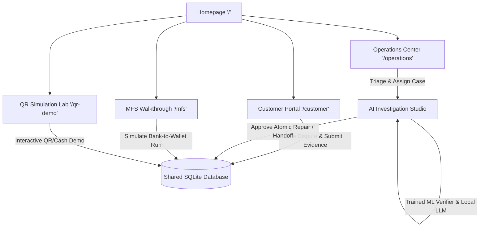

# DataUkil — Project Report
**Transaction Investigation & Operations Intelligence**  
*System Architecture, AI/ML Advisory Verification, and Operational Governance*

---

## 1. Executive Summary

**DataUkil** is an AI-assisted transaction investigation and operations intelligence platform designed to resolve complex, disputed payment incidents. Built specifically to handle scenarios such as "paid-twice" merchant complaints, stalled bank-to-wallet transfers, and ambiguous multi-channel transactions (QR, cash, MFS, bank accounts), DataUkil bridges the communication gap between customer statements and authoritative backend ledgers.

As a local **synthetic prototype**, payment records, bank journals, and customer identities are simulated within an isolated, deterministic environment. DataUkil features:
- A **Bilingual Customer Portal** (`/customer`) supporting real-time transaction progression, localized English/বাংলা messaging, and structured dispute submission.
- An **Operations Workspace** (`/operations`) for centralized incident triage, queue analytics, and multi-source ledger reconstruction.
- A **Dedicated AI Investigation Studio** (`/operations/cases/{case_id}/studio`) combining a trained ML advisory verifier with optional local LLM structured reasoning (`qwen3:4b-instruct`).
- **Strict Human-in-the-Loop Governance** where automated inferences cannot alter balances; corrections require operator approval, adhere to mathematical balance conservation, and execute through atomic sandbox actions.
- **End-to-End Test Verification**: Validated across **121 automated regression and integration tests** with 0 failures, supported by scripted end-to-end walkthroughs.

---

## 2. Problem Statement & Domain Context

In emerging mobile financial service (MFS) ecosystems (such as Bangladesh's upay and commercial banking integrations), transaction failure modes frequently produce customer friction:
1. **The "Paid-Twice" Dilemma**: A customer attempts a digital QR payment at a merchant. Due to network latency or timeout, the terminal indicates failure or delay; the customer then pays in cash or initiates a second transfer. Later, both payments register as debited.
2. **Stalled Add-Money Transfers**: A bank approves an outward transfer, but the recipient wallet system fails to post confirmation. Customers are left debited without credited funds, while front-line support lacks unified visibility across both bank and wallet settlement ledgers.
3. **Evidence Conflation**: Customer-provided claims, chat messages, or unofficial screenshots are often conflated with immutable source records, leading to incorrect manual reversals or prolonged dispute cycles.

**DataUkil resolves this** by enforcing an architectural invariant: *what is claimed by a customer is strictly decoupled from what is verified by source ledgers*. All evidence is indexed, timestamped, versioned, and cited before any corrective action is proposed.

---

## 3. System Architecture & Workspaces

The platform is organized into decoupled functional workspaces backed by a high-concurrency SQLite storage engine with partitioned ledger boundaries.



### 3.1 Workspace Directory & Routes

| Route | Workspace Name | Core Functionality |
|---|---|---|
| `/` | **Landing & Overview** | Dedicated Add money header/hero/feature entry, independent QR + cash link and Workspaces menu. |
| `/customer` | **Customer Portal** | 8 bank-to-upay synthetic scenarios, live stage visualization, timeline events, complaint submission, bilingual English/বাংলা toggle. |
| `/operations` | **Operations Center** | Live server-derived triage queue, incident cards, multi-source ledger comparison (Bank, Wallet, Core). |
| `/operations/cases/{id}/studio` | **AI Investigation Studio** | Deep-dive case workspace: multi-phase investigation pipeline, evidence citations, hypothesis generation, replay, and atomic sandbox repair approval. |
| `/qr-demo` | **QR & Cash Simulation Lab** | Unified customer/operator journey: failed QR display, cash receipt, observed late debit, complaint evidence, OpenCV visual annotations, synthetic Marketplace comparison and approved refund/rejection/owned handoff. |
| `/mfs` (also `/demo`) | **Add-Money Walkthrough** | Five-stage same-tab guide with explicit scenario setup, saved-run resume and expandable presenter controls. |
| `/customer/payment`<br>`/admin/queue` | **Add-Money Portals** | Dedicated role-scoped customer status view and rules-based investigator dispute queue. |

---

## 4. Phase-by-Phase Implementation Status

DataUkil was built iteratively across seven rigorously verified phases:

| Phase | Milestone | Operational Result |
|---|---|---|
| **Phase 1** | **Correctness & Identity** | Stable incident mapping, immutable audit tables, idempotent operations, and closure gates ensuring full repayment before case resolution. |
| **Phase 2** | **Synthetic Transfers & Customer Dashboard** | 8 persistent bank-to-upay fixtures, balance conservation enforcement, real-time stage progression, and English/বাংলা localization. |
| **Phase 3** | **Operations & Reconstruction** | Real-time triage queue, expandable payment source cards, unknown transaction state preservation. |
| **Phase 4** | **Durable Investigation & Local AI** | Saved investigation runs, trained advisory verifier, local Qwen structured JSON reasoning, automated fallback upon LLM timeout. |
| **Phase 5–6** | **Investigation Studio & Controlled Outcomes** | Evidence citation graph, hypothesis ranking, timeline replay controls (pause, speed, resume), isolated reset, and 3 approved atomic sandbox repairs. |
| **Phase 7** | **Coverage, Reports & Validation** | Automated Markdown/JSON report export, 33-section coverage matrix, and 121 automated test verifications. |

---

## 5. Machine Learning & Advisory Intelligence

DataUkil incorporates a hybrid intelligence model: a dedicated learned classifier head for evidence verification alongside local generative structured reasoning.

### 5.1 Trained Evidence Verifier
- **Architecture**: Frozen text embedding encoder combined with a trained logistic regression classification head.
- **Task**: Evaluates incoming customer claims, merchant assertions, and source record discrepancies to output an advisory classification.
- **Empirical Performance**:
  - **Grouped Synthetic Macro F1**: `0.827`
  - **Separately Authored Challenge Macro F1**: `0.471`
- **Integrity Boundary**: Scores reflect synthetic validation data and do not constitute unverified real-world accuracy claims. Rules serve as the primary deterministic baseline, with trained model predictions displayed separately for investigator transparency.

### 5.2 Local LLM Structured Reasoning (Ollama / Qwen)
- **Model**: Local `qwen3:4b-instruct` hosted via Ollama (`http://127.0.0.1:11434`).
- **Structured Output**: Strictly enforced JSON schema defining findings, cited evidence indices, hypotheses, and repair eligibility.
- **Operational Safety**:
  - Labeled as **`LIVE AI INVESTIGATION`** when the local model is responsive.
  - Automatically degrades to **`DEMO INVESTIGATION — SIMULATED AI TRACE`** if the local provider is offline, invalid, or exceeds timeout thresholds.
  - Private model chain-of-thought is never exposed to external views; all accepted steps are logged as distinct, auditable investigation events.

---

## 6. Financial Governance & Security Controls

Because DataUkil simulates financial reconciliation, enterprise-grade safety invariants are embedded into every operational route:

1. **Balance Conservation**: Every sandbox correction must balance to zero across source and destination ledgers ($\sum \Delta = 0$). No phantom credits can be created.
2. **Human-in-the-Loop Gate**: Machine learning models and LLMs are strictly advisory. Model outputs are completely prohibited from triggering balance updates or executing corrections directly.
3. **Multi-Point Backend Revalidation**: At the moment an operator approves a proposed repair, the backend independently re-verifies evidence integrity, case ownership, posting reference freshness, and exact currency amounts (in integer BDT minor units).
4. **Idempotency & Audit Trails**: Every corrective action requires unique idempotency tokens, preventing double-processing on network retries. All operator actions are appended to an immutable audit journal.

---

## 7. Verification & Test Coverage

The platform undergoes continuous validation across unit, integration, and end-to-end browser simulation suites:

```text
============================= test session starts =============================
platform win32 -- Python 3.13.7, pytest-9.1.1, pluggy-1.6.0
collected 121 items

tests/test_integration.py ..                                             [  1%]
tests/test_master.py ................................                    [ 28%]
tests/test_ml.py ...                                                     [ 30%]
tests/test_simulation.py .....................                           [ 47%]
tests/test_transfer.py ....................................              [ 77%]
tests/test_workflow.py ............................                      [100%]

======================== 121 passed, 1 warning in 64s =========================
```

- **Regression & Integration**: 121 automated pytest checks validate API contracts, route permissions, balance conservation, and localized rendering.
- **Add-Money Integration**: 27 dedicated checks ensure isolation between the master investigation cases and add-money MFS cases.
- **Master Walkthrough**: Reproducible via `scripts/master_walkthrough.py --live`, verifying synthetic receipt uploads, isolated database teardown, evidence verification, and export generation under `artifacts/`.

---

## 8. Operational Runbook

### 8.1 Launching the Application (PowerShell / Windows)

```powershell
# Navigate to workspace
cd D:\dataukil

# Launch server with automatic process cleanup and browser opening
.\run.ps1 -Restart
```

- **Verification Check**: Run `.\run.ps1 -Check` to verify ports and dependencies without launching.
- **Headless Mode**: Use `.\run.ps1 -Restart -NoBrowser` for automated background execution.
- **Alternative Port**: Run `.\run.ps1 -Restart -Port 8001` if port 8000 is occupied.

### 8.2 Direct Python Launch

```powershell
.\.venv\Scripts\python.exe -m uvicorn tracefix.app:app --host 127.0.0.1 --port 8000
```

### 8.3 ML Pipeline & Test Suite Execution

```powershell
# Retrain verifier and evaluate challenge test
.venv\Scripts\python.exe -m ml.train
.venv\Scripts\python.exe -m ml.evaluate

# Execute end-to-end automated walkthrough
.venv\Scripts\python.exe scripts\master_walkthrough.py --live

# Run full test suite
.venv\Scripts\python.exe -m pytest -q
```

---

## 9. Conclusion

DataUkil demonstrates an accountable, evidence-grounded approach to modern transaction dispute operations. By integrating trained advisory classification, local structured generative reasoning, and strict financial governance into an intuitive bilingual interface, it establishes a blueprint for transparent, verifiable payment recovery systems.
